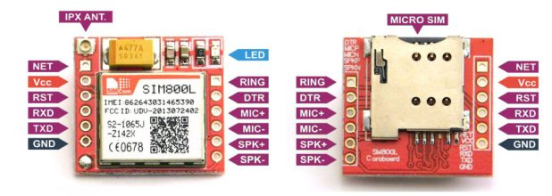
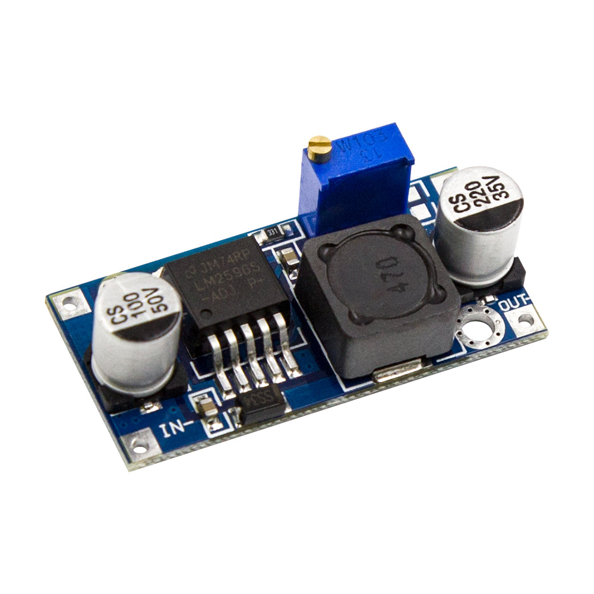
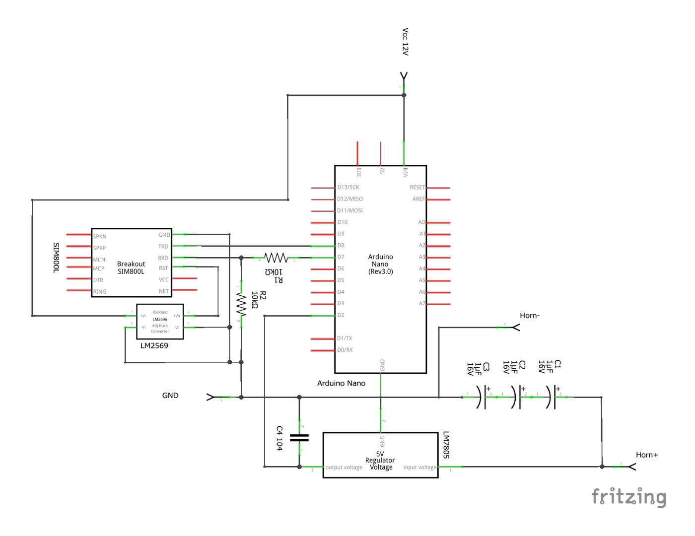
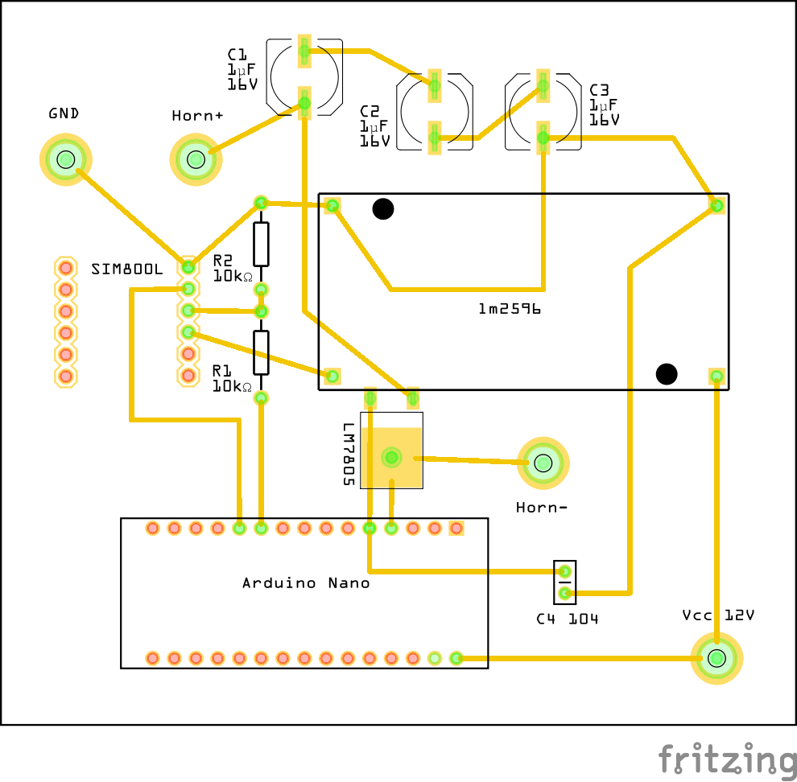
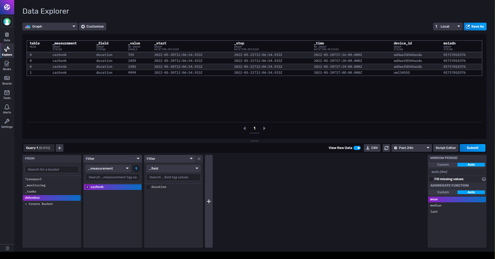

# Dehonk

## Hardware Configuration

### Interfacing SIM-800L Module with MCU

Pinout of SIM-800L is following:



At the heart of the module is a SIM800L GSM cellular chip from SimCom. The operating voltage of the chip is from 3.4V to 4.4V and we will be delivering just the right amount of voltage using a LM2596 DC-DV buck converter.



It has four pins: IN+, IN-, OUT+, OUT-


For this project, we will need to interface the SIM800L module with our MCU (Arduino Nano) with the following pins:

| SIM-800L | Arduino Nano | LM2596 |
|--|--|--|
| V<sub>cc</sub> (3.7V) | - | OUT+ |
| GND | GND | OUT- |
| TX | 8 | - |
| RX | 7<sup>[1](#footnote1)</sup> | - |

### Interfacing the Horn Module with MCU

The horn module uses 12V and that's not the correct voltage level for the MCU to read. So, we used a LM7805 Linear voltage regulator to decrease the voltage level to 5V. We could use another LM2596 module here, but that will increase the production cost.


This is the basic working circuit for the voltage regulator. It is recommened to use a heatsink with the regulator IC for over-heat protection.

Complete circuit diagram of the system is following:




### PCB Layout



## Loading Sketch

> This project is developed and tested in [EndeavourOS](https://endeavouros.com/) machine. For all standard Linux based systems following instructions are expected to work.

### Install VS Code

Use [Snap](https://snapcraft.io/code) to install VS Code if not installed already.

```bash
sudo snap install code --classic
```

If your system does not have snap installed already, install it.

```bash
sudo apt update
sudo apt install snapd
```

### Install PlatformIO

PlatformIO was used for smoother development and debugging features. It has all the necessary tool-chains for embedded system development. Install the [PlatformIO extension](https://marketplace.visualstudio.com/items?itemName=platformio.platformio-ide) for VS Code.

Launch VS Code Quick Open ( <kbd>Ctrl</kbd> + <kbd>P</kbd> ), paste the following command, and press enter.

```bash
ext install platformio.platformio-ide
```

>Arduino IDE is also one of its dependency. install it from [SnapCraft](https://snapcraft.io/code) with the following command:
>
>```bash
>$ sudo snap install arduino
>```
>
>If facing any problem to upload code to device, these commands may faix it.
>
>```bash
>$ sudo usermod -a -G dialout $USER
>$ arduino.pip install requests
>```
>
>On Arch based systems:
>
>```bash
>$ sudo uucp -a -G dialout $USER
>```

### Configuring PlatformIO  

Plug in the Arduino USB cable in a USB port and issue following command:

```bash
dmesg | grep tty
```

The last line of the output should contain the name of the serial port the arduino is connected to. It should be something like `ttyACM0`  or `ttyUSB0`.

Now navigate to **platformio.ini** file located in the project root directory and set the `upload_port` and `monitor_port` to the serial port name the Arduino is connected to.

Example:

```ini
[env:nanoatmega328]
platform = atmelavr
board = nanoatmega328
framework = arduino
upload_port = /dev/ttyUSB0
monitor_port = /dev/ttyUSB0
monitor_speed = 115200
```

Follow the [official documentation](https://docs.platformio.org/en/latest/integration/ide/vscode.html) of platformIO if necessary.

### Upload Sketch

Upon connecting the board and configuring it correctly, Open VS Code command pallette with pressing <kbd>Ctrl</kbd> + <kbd>Shift</kbd> + <kbd>P</kbd>.

Use the `PlatformIO: Upload` command to upload the code to the board.

## Data Telemetry

### InfluxDB

InfluxDB is an open-source time series database developed by the company InfluxData. It is written in the Go programming language for storage and retrieval of time series data in fields such as operations monitoring, application metrics, Internet of Things sensor data, and real-time analytics.

#### InfluxDB API

We are using [InfluxDB API](https://docs.influxdata.com/influxdb/v2.0/write-data/developer-tools/api/) to write data from the device to the server.

#### InfluxDB UI

InfluxDB provides an advanced web UI to manage and query data from the database. That UI is accessible in `http://<server_address>:8086`. Detailed information on influxDB can be found in their [documentation](https://docs.influxdata.com/influxdb/v2.0/).



## References

1. With a voltage divider to protect the module from over-voltaged logic level of the MCU, [Arduino Forum](https://forum.arduino.cc/t/how-to-give-the-right-power-supply-volts-current-for-sim800l-gsm/391672)
2. InfluxDB: The Time Series Data Platform where developers build IoT, analytics, and cloud applications., [influxdata.com](https://www.influxdata.com/)

___

##### Footnotes

<a name="footnote1">[1]</a> With a voltage divider to protect the module from over-voltaged logic level of the MCU.</br>
